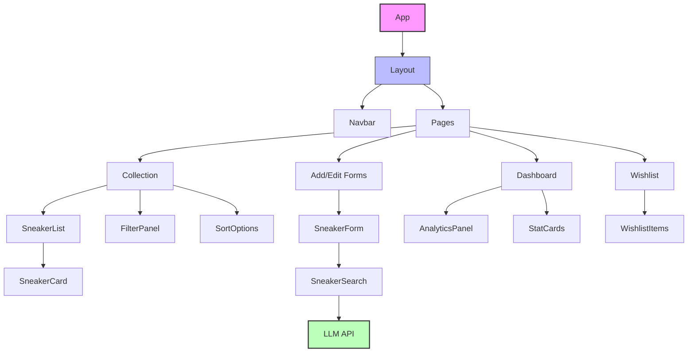
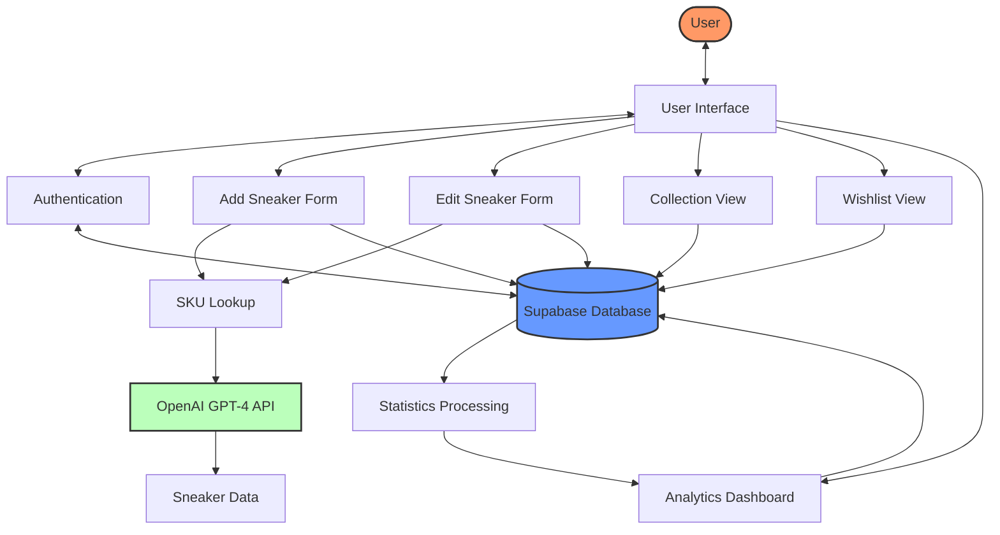
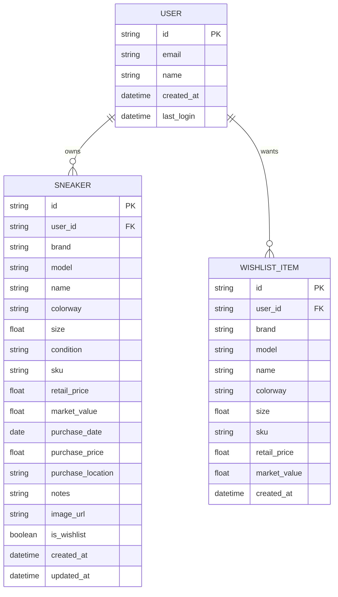

# Sneaker Collect Plus
A sneaker collection app that will allow me to add, view, and edit sneakers in my collection.
The app will have intuitive search and filter functionality.

## What can it do
- Add a sneaker to the collection
    - add sneaker by sku number, common name
    - search a common sneaker database to obtain details about sneaker (ie api)
    - use OpenAI GPT-4 Turbo to automatically find sneaker details by SKU
- View all sneakers in the collection
- Edit a sneaker in the collection
    - manually update sneaker details
    - automatically update information using OpenAI GPT-4 Turbo by SKU lookup
- Delete a sneaker from the collection
- Search for a sneaker in the collection
- Filter the sneakers in the collection by brand, model, colorway, size, etc.
- Sort the sneakers in the collection by name, brand, model, colorway, size, etc.
- Add a sneaker to the wishlist
- View all sneakers in the wishlist
- Delete a sneaker from the wishlist
- Be able to view rich infomatics about my collection like total value of collection, most valuable sneakers, etc.

## UI/UX Design
- **Dashboard**: Main landing page showing collection overview, stats, and quick access to features
- **Collection View**: Grid/list view of all sneakers with image thumbnails and key details
- **Detail View**: Expanded view of a single sneaker with all information and actions
- **Add/Edit Form**: Intuitive form for adding or editing sneaker details
- **Search & Filter Panel**: Easy-to-use controls for finding specific sneakers
- **Wishlist Section**: Similar to collection view but for desired sneakers
- **Analytics Dashboard**: Visual representation of collection statistics
- **Responsive Design**: Optimized for both desktop and mobile experiences

## Architecture

### Component Diagram
The following diagram shows the main components of the application and their relationships:



### Data Flow Diagram
This diagram illustrates how data flows through the application:



### Entity Relationship Diagram
This diagram shows the data model of the application:



## Future Design
- Use AI to make recommendations of new sneakers based on what I have in my collection
    - pull data about upcoming sneakers 
    - create mini blog about upcoming sneakers
- Make application optimized for mobile
- Add social features to share collection highlights
- Implement price tracking and value history

## Tech Stack
- Next.js
- Tailwind CSS
- Shadcn UI
- Supabase
- Stripe
- Sneaker APIs (StockX, GOAT, or similar for data)
- Jest and React Testing Library for testing

## Development Roadmap
1. Set up project structure and tech stack
2. Create database schema and API endpoints
3. Implement core UI components
4. Build CRUD functionality for sneaker management
5. Implement search, filter, and sort features
6. Add wishlist functionality
7. Develop analytics dashboard
8. Polish UI/UX and responsive design
9. Testing and bug fixes
10. Deployment

## Testing
The application includes a comprehensive test suite using Jest and React Testing Library. Tests cover:
- Utility functions
- Schema validation
- Component rendering and interactions
- API integration

To run the tests:
```bash
npm test
```

To run tests with coverage report:
```bash
npm test -- --coverage
```


