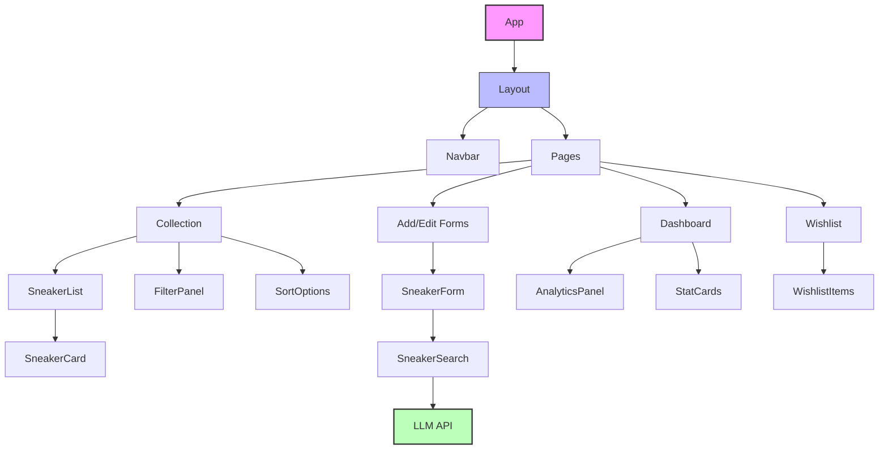
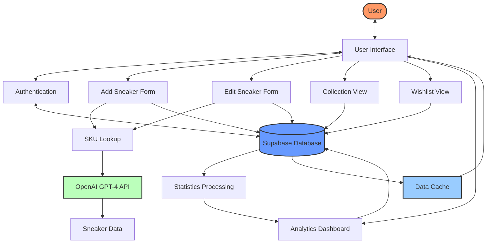
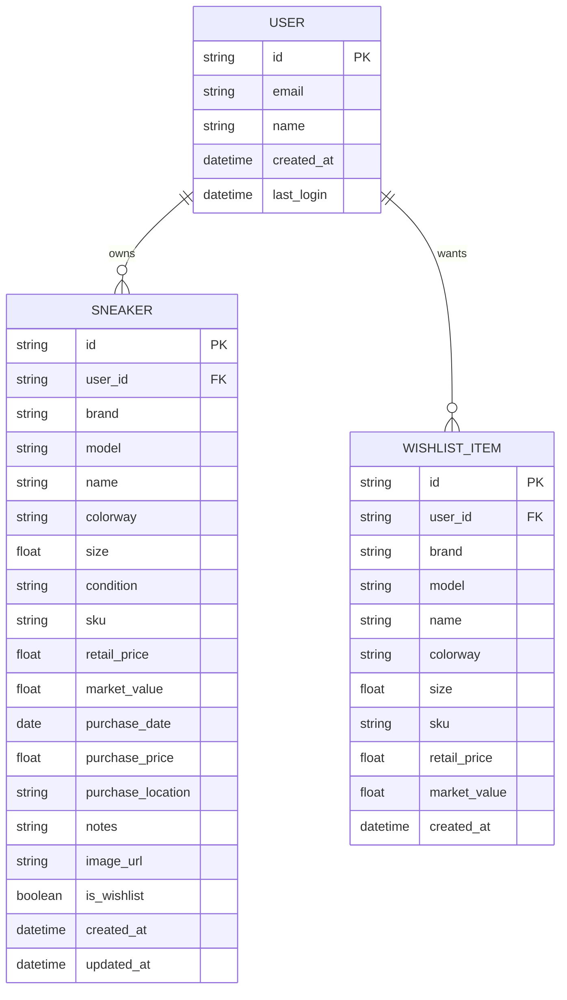

# Sneaker Collect Plus
A sneaker collection app that will allow me to add, view, and edit sneakers in my collection.
The app will have intuitive search and filter functionality.

## What can it do
- Add a sneaker to the collection
    - add sneaker by sku number, common name
    - search a common sneaker database to obtain details about sneaker (ie api)
    - use OpenAI GPT-4 Turbo to automatically find sneaker details by SKU
- View all sneakers in the collection
    - browse a comprehensive dataset of over 80 sneakers
    - view detailed information about each sneaker
- Edit a sneaker in the collection
    - manually update sneaker details
    - automatically update information using OpenAI GPT-4 Turbo by SKU lookup
- Delete a sneaker from the collection
- Search for a sneaker in the collection
- Filter the sneakers in the collection by brand, model, colorway, size, etc.
- Sort the sneakers in the collection by name, brand, model, colorway, size, etc.
- Add a sneaker to the wishlist
- View all sneakers in the wishlist
- Delete a sneaker from the wishlist
- Be able to view rich infomatics about my collection like total value of collection, most valuable sneakers, etc.
- Access StockX market data for sneakers (test implementation)

## UI/UX Design
- **Dashboard**: Main landing page showing collection overview, stats, and quick access to features
- **Collection View**: Grid/list view of all sneakers with image thumbnails and key details
- **Detail View**: Expanded view of a single sneaker with all information and actions
- **Add/Edit Form**: Intuitive form for adding or editing sneaker details
- **Search & Filter Panel**: Easy-to-use controls for finding specific sneakers
- **Wishlist Section**: Similar to collection view but for desired sneakers
- **Analytics Dashboard**: Visual representation of collection statistics
- **Responsive Design**: Optimized for both desktop and mobile experiences
- **Design System**: Comprehensive design system with consistent typography, spacing, and components
- **Animations**: Smooth animations and transitions for a polished user experience

## Performance Optimizations
- **Code Splitting**: Lazy loading of components to reduce initial bundle size
- **Image Optimization**: Efficient image loading with lazy loading, progressive loading, and proper sizing
- **Caching**: In-memory cache for database queries and API calls
- **Database Optimization**: Batch loading and query optimization for efficient data fetching
- **Bundle Size Reduction**: Optimized webpack configuration for smaller bundle sizes

## Architecture

### Routing System
The application uses a custom routing solution to handle dynamic routes in Next.js. This approach provides several benefits:

- **Dynamic Route Handling**: Properly handles routes with parameters like `/collection/[id]`
- **Parameter Extraction**: Automatically extracts and passes parameters to page components
- **Authentication Integration**: Seamlessly integrates with the authentication system for protected routes
- **Lazy Loading Support**: Works with code splitting and lazy loading for optimal performance

The custom router is implemented in `routes.tsx` and uses regex patterns to match routes and extract parameters.

### Component Diagram
The following diagram shows the main components of the application and their relationships:



### Data Flow Diagram
This diagram illustrates how data flows through the application:



### Entity Relationship Diagram
This diagram shows the data model of the application:



## Future Design
- Use AI to make recommendations of new sneakers based on what I have in my collection
    - pull data about upcoming sneakers 
    - create mini blog about upcoming sneakers
- Make application optimized for mobile
- Add social features to share collection highlights
- Implement price tracking and value history

## Tech Stack
- Next.js
- Tailwind CSS
- Shadcn UI
- Supabase
- Framer Motion (for animations)
- OpenAI GPT-4 API
- Jest and React Testing Library for testing
- Docker and Docker Compose for containerization

## Development Roadmap
1. Set up project structure and tech stack
2. Create database schema and API endpoints
3. Implement core UI components
4. Build CRUD functionality for sneaker management
5. Implement search, filter, and sort features
6. Add wishlist functionality
7. Develop analytics dashboard
8. Polish UI/UX and responsive design
9. Testing and bug fixes
10. Performance optimizations
11. Containerization with Docker
12. Deployment

## Dataset
The application includes a comprehensive dataset of over 80 sneakers from various brands including Nike, Jordan, Adidas, New Balance, and more. The dataset includes:
- Detailed sneaker information (brand, model, name, colorway)
- SKU numbers for accurate identification
- High-quality images for each sneaker
- Release dates
- Price information

This dataset is used to populate the mock database for development and testing purposes.

## Bug Fixes and Improvements

### Routing System Enhancement
The application initially faced issues with blank pages when navigating to dynamic routes like sneaker detail pages. This was resolved by implementing a custom routing solution that:

- Properly handles dynamic routes with parameters
- Extracts and passes parameters to page components
- Integrates with the authentication system
- Provides better error handling and debugging

This enhancement ensures smooth navigation throughout the application, particularly when viewing and editing sneaker details.

### Data Handling Improvements
- Fixed issues with special characters in sneaker names
- Implemented proper date handling for purchase dates
- Added support for various sneaker conditions including "worn"
- Enhanced error handling for data loading and submission

## Getting Started

### Local Development

You can run the application locally using npm:

```bash
cd app
npm install
npm run dev
```

### Docker Development Environment

For a consistent development experience, you can use the Docker setup:

1. Make sure Docker and Docker Compose are installed
2. Run the development environment:
   ```bash
   chmod +x docker-dev.sh
   ./docker-dev.sh start
   ```
3. Access the application at http://localhost:80

The Docker setup includes:
- Next.js application container
- PostgreSQL database container
- Redis cache container
- Nginx proxy container

For more details on the Docker setup, see [DOCKER.md](./DOCKER.md).

## Testing
The application includes a comprehensive test suite using Jest and React Testing Library. Tests cover:
- Utility functions
- Schema validation
- Component rendering and interactions
- API integration
- Performance utilities (caching, batch loading)

### Running Tests Locally

To run the tests locally:
```bash
cd app
npm test
```

To run tests with coverage report:
```bash
cd app
npm test -- --coverage
```

### Running Tests in Docker

To run tests in the Docker environment:
```bash
./docker-dev.sh test
```

## Performance Analysis
The application includes tools for analyzing and optimizing performance:

```bash
# Analyze the bundle size
npm run analyze

# Analyze only the server bundle
npm run analyze:server

# Analyze only the browser bundle
npm run analyze:browser
```

## Documentation
Additional documentation can be found in the `docs` directory:
- [Performance Optimizations](./docs/performance-optimizations.md)
- [Docker Setup](./DOCKER.md)

## StockX API Integration (Test Implementation)

The application includes a test implementation of StockX API integration that allows you to:

1. Search for sneakers on StockX
2. View detailed product information
3. Access market data including lowest ask, highest bid, and sales history

**Note:** This is currently a mock implementation using sample data. In a production environment, you would need to implement the actual StockX API integration.

### StockX API Test Page

A dedicated test page is available at `/stockx-test` to demonstrate the potential of the StockX API integration. This page allows you to:

- Search for sneakers
- View search results
- See detailed product information
- Access market data

### Environment Variables

To use the StockX API integration, you need to set the following environment variables:

```
STOCKX_EMAIL_ENCODED=<base64_encoded_email>
STOCKX_PASSWORD_ENCODED=<base64_encoded_password>
```

For security reasons, the credentials are stored in Base64 encoded format.

## StockX API Integration

The application includes a StockX API integration via Retailed.io that allows you to:

1. Search for sneakers on StockX by SKU
2. View detailed product information
3. Access market data including lowest ask, highest bid, and sales history
4. Get real-time pricing information

The StockX integration provides real-time market data for sneakers, helping you make informed decisions about your collection and potential purchases.

### Features

- **SKU Search**: Search for sneakers by SKU number for precise results
- **Detailed Information**: View comprehensive details about each sneaker
- **Market Data**: See current market prices, including lowest ask and highest bid
- **Real-time Pricing**: Get up-to-date pricing information from StockX
- **Seamless Integration**: Easily add sneakers to your collection with accurate market values

### API Integration

The application uses the Retailed.io API to access StockX data. This provides a reliable and up-to-date source of sneaker market information without requiring direct authentication with StockX.

## Getting Started

### Prerequisites

- Node.js 16.x or higher
- npm or yarn

### Installation

1. Clone the repository
2. Install dependencies:
   ```
   npm install
   ```
3. Set up environment variables (see `.env.example`)
4. Run the development server:
   ```
   npm run dev
   ```

## Docker Support

The application includes Docker support for easy deployment and development.

### Development

```
./docker-dev.sh start
```

### Production

```
./docker-prod.sh start
```

## License

This project is licensed under the MIT License - see the LICENSE file for details.


