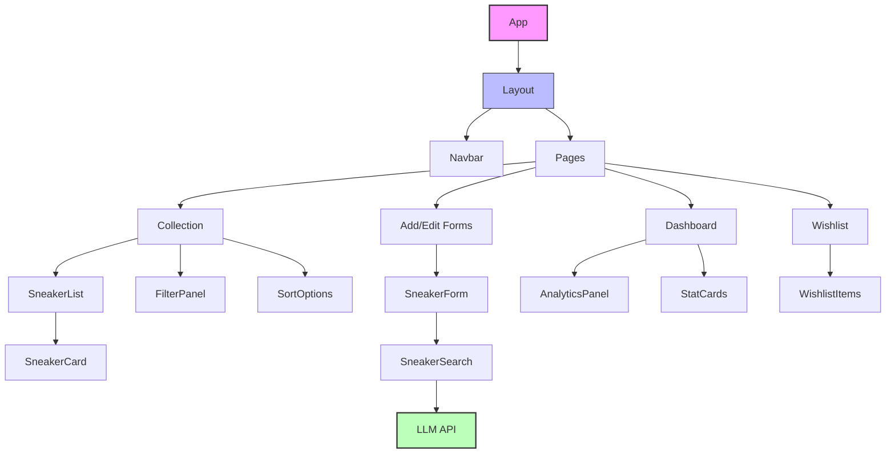
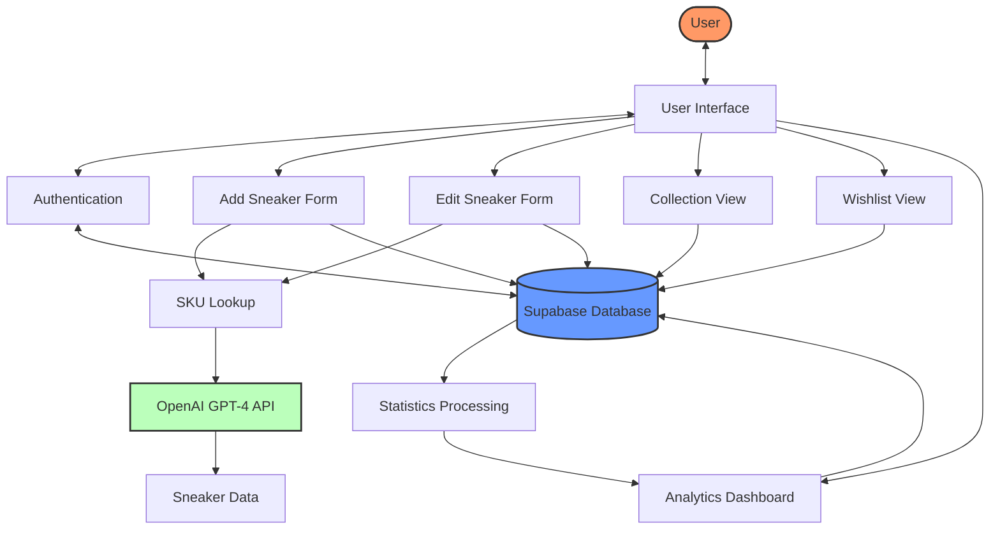
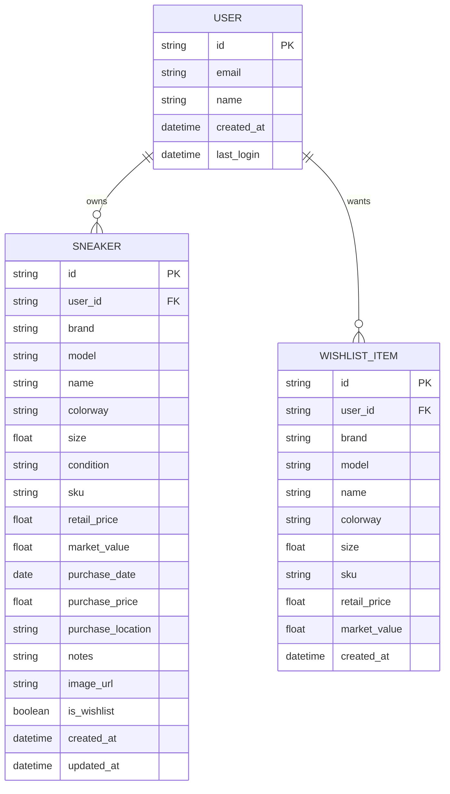

# Sneaker Collect Plus

A modern web application for tracking and organizing your sneaker collection.

## Features

- Add, view, edit, and delete sneakers in your collection
- Search, filter, and sort your collection
- Manage your sneaker wishlist
- View analytics about your collection
- Responsive design for desktop and mobile
- OpenAI GPT-4 Turbo integration for accurate sneaker lookup by SKU
- Auto-update sneaker information using OpenAI GPT-4 Turbo

## Architecture

### Component Diagram
The following diagram shows the main components of the application and their relationships:



### Data Flow Diagram
This diagram illustrates how data flows through the application:



### Entity Relationship Diagram
This diagram shows the data model of the application:



## Tech Stack

- Next.js
- TypeScript
- Tailwind CSS
- Shadcn UI
- Supabase
- Stripe
- Chart.js
- Jest and React Testing Library for testing

## Getting Started

### Prerequisites

- Node.js 18.x or later
- npm or yarn

### Installation

1. Clone the repository
2. Install dependencies:
   ```bash
   npm install
   # or
   yarn install
   ```
3. Copy `.env.local.example` to `.env.local` and fill in your environment variables
4. Run the development server:
   ```bash
   npm run dev
   # or
   yarn dev
   ```
5. Open [http://localhost:3000](http://localhost:3000) in your browser

## Testing

The application includes a comprehensive test suite using Jest and React Testing Library. To run the tests:

```bash
# Run all tests
npm test

# Run tests in watch mode (for development)
npm run test:watch

# Run tests with coverage report
npm test -- --coverage
```

### Test Structure

- Unit tests for utility functions and schema validation
- Component tests for UI components
- Integration tests for pages and features

Tests are co-located with the code they test in `__tests__` directories.

### Test Implementation Details

The test suite includes:

- Mock implementations for Next.js router, authentication, and Supabase
- Proper handling of asynchronous operations with `act()` and `waitFor()`
- Component rendering tests with realistic user interactions
- Validation of component state and UI updates

### Common Testing Issues and Solutions

- **Router Mocking**: The `useRouter` hook from Next.js is mocked globally in `jest.setup.js`
- **Authentication**: The auth context is mocked to provide a consistent user state
- **Asynchronous Testing**: All component tests use `act()` to properly handle React state updates
- **Test Timeouts**: Increased timeouts for complex component tests to prevent flaky tests

### Test Coverage

The test suite is configured to collect coverage information. After running the tests, you can view the coverage report in the `coverage` directory.

## Project Structure

- `src/app`: Next.js App Router pages and layouts
- `src/components`: Reusable UI components
- `src/lib`: Utility functions and shared code
- `src/utils`: Helper functions
- `public`: Static assets
- `__tests__`: Test files (co-located with the code they test)

## Development Roadmap

1. Set up project structure and tech stack ✅
2. Create database schema and API endpoints ✅
3. Implement core UI components ✅
4. Build CRUD functionality for sneaker management ✅
5. Implement search, filter, and sort features ✅
6. Add wishlist functionality ✅
7. Develop analytics dashboard
8. Polish UI/UX and responsive design ✅
9. Testing and bug fixes ✅
10. Deployment 